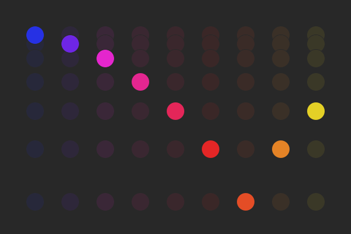

# Bouncy Ball

  

This project compares web animation techniques by recreating a simple animation (a bouncing ball) with each one. It's kind of like TodoMVC, but for web animation.

This repository is two things:

  1. A **[directory](https://github.com/sparkbox/bouncy-ball/tree/gh-pages/examples)** containing examples and documentation for each animation technique.
  2. A **[demo site](http://sparkbox.github.io/bouncy-ball/)** where you can see the animations and read the source code required to create each one.

## Project Goals

  1. **Curate** the most popular and common web-animation techniques.
  2. **Compare** the techniques interactively.
  3. **Educate** developers with basic information for each technique.

### Performance

This project does not attempt to compare the performance of these animation approaches. If you are interested in a comparison like this, consider using a FPS bookmarklet, like [this one from stats.js](https://github.com/mrdoob/stats.js/#bookmarklet).

To learn more on how to build, profile, and optimize, performant web-animations, check out these resources:

  * [HTML5 Animation Speed Test](https://greensock.com/js/speed.html) - A performance comparison / stress-test of several animation libraries, by GreenSock.
  * [An Introduction to Hardware Acceleration with CSS Animations](https://www.sitepoint.com/introduction-to-hardware-acceleration-css-animations/) - A detailed post on hardware acceleration for web animations.
  * [jankfree.org](http://jankfree.org/) - A great collection of resources for learning about high-performance web rendering, and performance profiling tools.

## Other Resources for Comparing Animations

  * [A Comparison of Animation Technologies](https://css-tricks.com/comparison-animation-technologies/)
  * [Weighing SVG Animation Techniques (with Benchmarks)](https://css-tricks.com/weighing-svg-animation-techniques-benchmarks/)

## Contributing

 For questions, ideas, or bugs, feel free to [open an issue](https://github.com/sparkbox/bouncy-ball/issues/new). Pull requests are even better, though you'll want to read the [contribution guidelines](https://github.com/sparkbox/bouncy-ball/blob/gh-pages/contributing.md) first.

## License

[MIT](https://github.com/sparkbox/bouncy-ball/blob/gh-pages/license.md)
